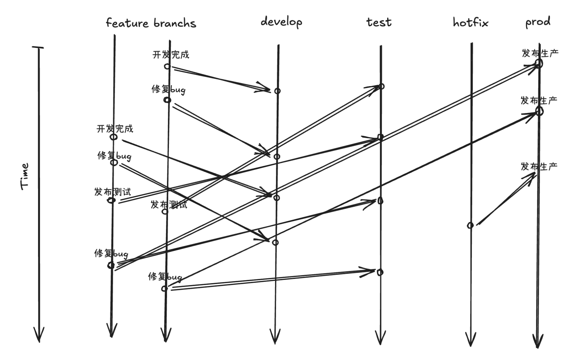
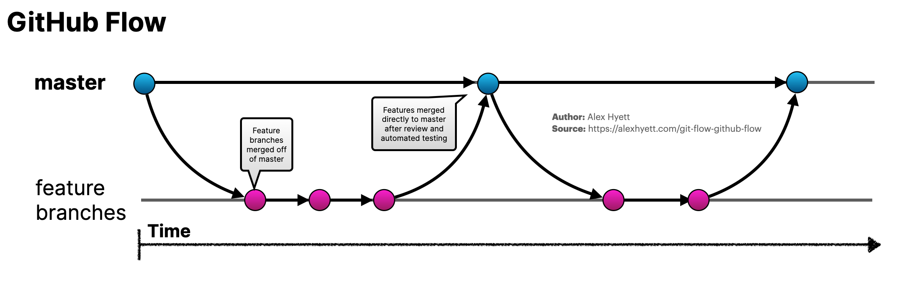
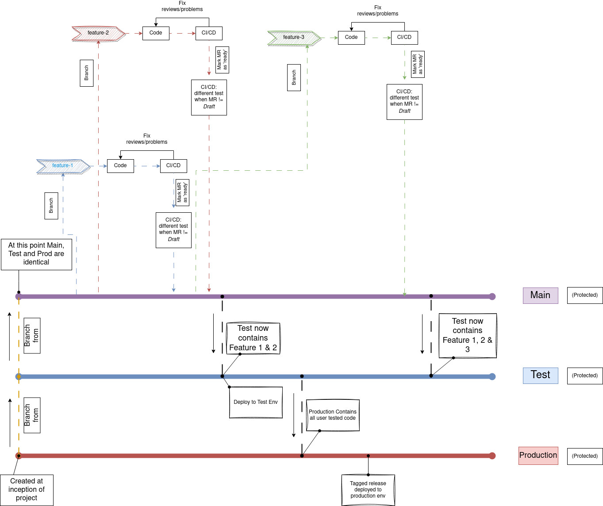
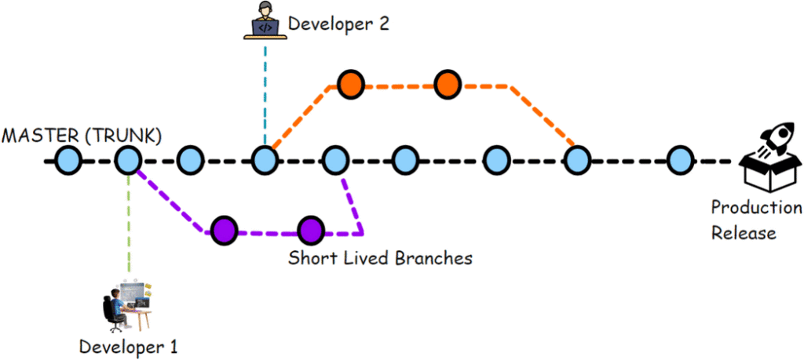

# 背景

- **版本管理的演进**：本地版本管理 → 远程中心化版本管理 → 远程分布式版本管理
- **Git 工作流的演进**：无工作流 → Git Flow → GitHub Flow → GitLab Flow → Trunk-Based Development
- **推动因素**：
  - 团队规模增长
  - 代码仓库体量增加带来的性能挑战
  - 敏捷开发/CI/CD 理念普及
  - 用户体验优化需求
  - 安全性考量

# 高效 Git 工作流的特征

- **适应多种场景**：
  - 按需发布
  - 多功能并行开发、测试
  - 持续集成/按版本集成
  - 双重Code Review
- **核心特点**：
  - 适配业务场景
  - 认知开销低
  - 扩展性高
  - 错误可追溯与撤销
  - 设计简约清晰
  - 规范合理且易于遵循
- **理想开发流程**：
  1. 开发完成并推送代码
  2. 自动合并到对应环境
  3. 智能解决冲突
  4. 自动执行发布操作
  5. 发布完成后通知测试团队

# 基于 Feature 分支的工作流模型

## 核心分支结构

| 分支名称 | 来源分支 | 合并目标分支 | 环境绑定 | 生命周期 | 说明 |
|---------|---------|------------|---------|---------|------|
| prod | - | - | 生产环境 | 永久 | 稳定分支，随时可部署 |
| test | prod | - | 测试环境 | 永久 | 用于测试环境验证，独立运行 |
| dev | prod | - | 开发环境 | 永久 | 用于开发环境调试，独立运行 |
| feat/* | prod | dev, test, prod | - | 临时，发布完成后删除 | 功能开发分支 |
| hotfix/* | prod | prod | - | 临时，发布完成后删除 | 紧急修复分支，直接修复生产问题 |

## 分支图



## 工作流程示例

```bash
# 从生产分支创建功能分支
git checkout -b feature/xxx prod

# 开发完成后合并到开发环境进行验证
git checkout dev && git merge --no-ff feature/xxx

# 验证通过后合并到测试环境
git checkout test && git merge --no-ff feature/xxx

# 测试通过后发布到生产环境
git checkout prod && git merge --no-ff feature/xxx
```

## 优缺点分析

- ✅ 按需部署能力：功能可以选择性地合并到不同环境，支持功能的独立发布
- ✅ 多层次质量保障：双重 Code Review (feat→sit, feat→prod)
- ✅ 严格环境控制：不同环境有独立分支，不同环境分支有独立权限
- ✅ 渐进式测试：功能可以先在开发环境验证（比如冒泡测试），再到测试环境全面测试，最后才进入生产
- ❌ 分支爆炸问题：需要定期清理已发布功能分支
- ❌ 可能需要多次解决相同冲突
- ❌ Merge Request 过程中解决冲突会产生额外合并提交


# 主流工作流介绍

## 1. Git Flow

**适用场景**：中大型项目、多版本并行维护、严格发布周期

**核心分支**：
- main（生产环境）
- develop（集成分支）
- feature/*（功能分支）
- release/*（预发布分支）
- hotfix/*（紧急修复分支）

**核心分支结构**：

| 分支名称 | 来源分支 | 合并目标分支 | 环境绑定 | 生命周期 | 说明 |
|---------|---------|------------|---------|---------|------|
| main | - | - | 生产环境 | 永久 | 稳定分支，保存已发布的版本 |
| develop | main | - | 开发环境 | 永久 | 开发集成分支，包含最新功能 |
| feature/* | develop | develop | - | 临时，功能完成后删除 | 功能开发分支，完成后合并回develop |
| release/* | develop | develop, main | 预发布环境 | 临时，发布完成后删除 | 版本发布准备分支，修复后同时合并到develop和main |
| hotfix/* | main | main, develop | - | 临时，修复完成后删除 | 紧急修复分支，修复生产问题后合并到main和develop |

**分支图**：


**优缺点**：
- ✅ 严格环境隔离、支持多版本并行维护
- ✅ 清晰的分支职责划分，便于团队理解和遵循
- ✅ 适合有计划的版本发布和迭代
- ✅ 通过release分支提供预发布测试的机会
- ❌ 分支结构复杂、学习成本高
- ❌ 频繁的分支合并可能导致冲突增多
- ❌ 不适合需要快速迭代的项目
- ❌ 工作流程相对僵化，对敏捷开发支持有限

## 2. GitHub Flow

**适用场景**：小型团队、高频发布、SaaS 产品

**核心分支结构**：

| 分支名称 | 来源分支 | 合并目标分支 | 环境绑定 | 生命周期 | 说明 |
|---------|---------|------------|---------|---------|------|
| main | - | - | 生产环境 | 永久 | 主分支，始终保持可部署状态 |
| feature/* | main | main | - | 临时，功能完成后删除 | 功能开发分支，通过PR合并回main |

**分支图**：



**优缺点分析**：

- ✅ 简单直观：流程简单，易于理解和执行
- ✅ 持续部署友好：适合需要频繁发布的产品
- ✅ PR驱动开发：通过Pull Request进行代码审查和讨论
- ✅ 分支管理简洁：只有主分支和临时功能分支
- ❌ 缺少预发布验证环节：功能直接合并到生产分支
- ❌ 不适合多版本并行维护：难以支持多个版本的并行开发
- ❌ 对自动化测试依赖较高：需要完善的自动化测试保障质量

## 3. GitLab Flow

**适用场景**：需要与环境部署紧密结合的项目、持续交付模式

**核心分支结构**：

| 分支名称 | 来源分支 | 合并目标分支 | 环境绑定 | 生命周期 | 说明 |
|---------|---------|------------|---------|---------|------|
| production | - | - | 生产环境 | 永久 | 生产环境分支，反映当前部署状态 |
| pre-production | production | production | 预发布环境 | 永久 | 预发布环境分支，用于最终验证 |
| dev | pre-production | pre-production | 开发环境 | 永久 | 开发集成分支，包含已完成功能 |
| feature/* | dev | dev | - | 临时，功能完成后删除 | 功能开发分支，完成后合并到dev |

**分支图**：



**优缺点**：
- ✅ 环境与分支紧密绑定，部署流程透明可追踪
- ✅ 支持持续交付模式，适合需要频繁部署的项目
- ✅ 环境分支提供了明确的质量关卡
- ✅ 比Git Flow更简洁，比GitHub Flow更严谨
- ❌ 分支层级较多，管理复杂度增加
- ❌ 可能导致分支间同步延迟问题
- ❌ 需要更多的合并操作和冲突解决

## 4. Trunk-Based Development（主干开发）

**适用场景**：超大型团队、极高频集成（如 Google、Facebook）

**核心分支结构**：

| 分支名称 | 来源分支 | 合并目标分支 | 环境绑定 | 生命周期 | 说明 |
|---------|---------|------------|---------|---------|------|
| trunk/main | - | - | 生产环境 | 永久 | 主干分支，所有开发都基于此分支 |
| release/* | trunk | - | 生产环境 | 临时，版本发布后可能保留 | 可选的发布分支，用于版本发布 |
| feature/* | trunk | trunk | - | 临时，功能完成后删除 | 短生命周期功能分支（通常<1天），快速合并回主干 |

**分支图**：



**核心规则**：
- 开发直接提交到主干或极短生命周期分支（1-2天内合并）
- 依赖特性开关（Feature Flags）控制功能可见性
- 高度自动化测试和持续集成保障质量
- 每次提交都必须通过所有测试

**优缺点**：
- ✅ 减少分支管理负担、加速集成和反馈
- ✅ 避免长期分支带来的合并地狱
- ✅ 支持持续部署和小批量发布
- ✅ 鼓励频繁提交和代码共享
- ❌ 对测试自动化和代码质量要求极高
- ❌ 需要完善的特性开关机制
- ❌ 团队需要高度纪律性和协作
- ❌ 初期实施成本较高

# 工作流选择指南

## 关键决策因素

- 团队规模与协作模式
- 发布频率与稳定性需求
- 项目复杂度
- 特定业务场景支持
- 持续集成还是按版本集成

## 工作流对比

| 工作流 | 分支复杂度 | 发布频率 | 适用团队规模 | CI/CD 友好度 |
|-------|-----------|---------|------------|------------|
| Git Flow | 高 | 低频 | 中大型 | 中等 |
| GitHub Flow | 低 | 高频 | 小型、中型 | 高 |
| GitLab Flow | 中 | 高频 | 中大型 | 高 |
| Trunk-Based | 极低 | 极高频 | 超大型 | 极高 |
| 基于 Feature 分支的工作流模型 | 高 | 低频 | 中大型 | 中等 |

# 工具与生态支持

## Git 图形化工具
- GitKraken、SourceTree、VS Code Git 插件、Git Tower

## 代码托管平台集成
- GitHub Actions、GitLab CI/CD、Bitbucket Pipelines
- Jenkins、CircleCI、Travis CI

## 辅助工具
- Husky（Git 钩子管理）
- Commitizen（规范化提交）
- Conventional Commits（提交信息规范）
- Semantic Release（语义化版本发布）

# 结语

1. **没有"银弹"工作流**：根据团队需求和项目特点灵活选择和调整
2. **持续优化**：定期回顾工作流程，结合自动化工具提升效率
3. **团队共识**：工作流的成功取决于团队的理解和执行，而非流程本身的复杂度

# 参考资料

- [Git Flow: A successful Git branching model](https://nvie.com/posts/a-successful-git-branching-model/)
- [GitHub Flow](https://guides.github.com/introduction/flow/)
- [GitLab Flow](https://docs.gitlab.com/ee/topics/gitlab_flow.html)
- [Trunk-Based Development](https://trunkbaseddevelopment.com/)
- [Linux 内核的代码仓库管理与开发流程](https://git.kernel.org/pub/scm/linux/kernel/git/torvalds/linux.git/)
- [Pro Git Book - 分布式工作流程](https://git-scm.com/book/zh/v2/分布式-Git-分布式工作流程)
