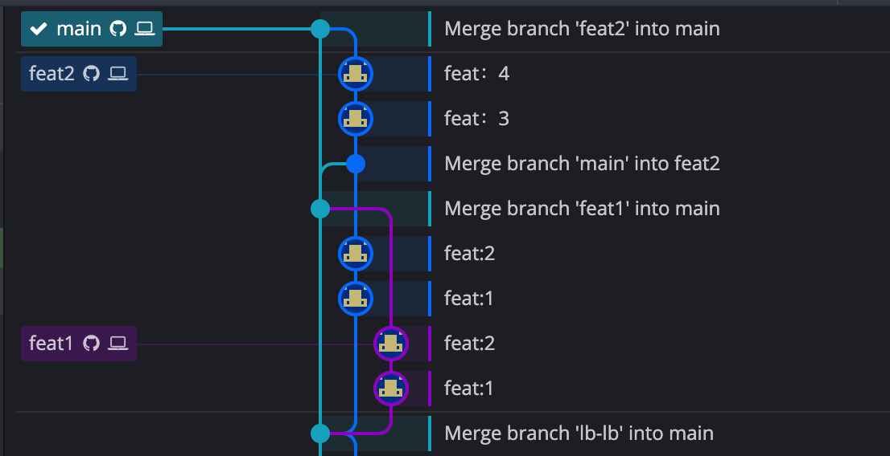
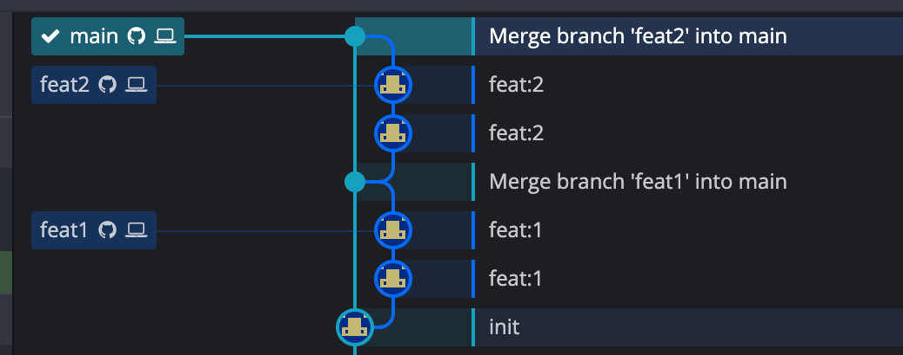

# git rebase

## 是什么
首先想想这样一个 git 使用场景，项目开发人员基于 master 分支建立自己的 feature，假设分别为 feat1 和 feat2，经过一段时间的开发 feat1 开发完成了并 merge 进了 master，这时 feat2 为了跟进 master 代码的更新需要把 master 的更新合并到 feat2（可以 merge 也可以 pull），如果直接 merge 在提交历史记录中会存在 master 合并进 feat2 的合并流，更理想的操作是，只有 feat merge 进 master 这种情况，这会让分支历史看起来非常美观，rebase 做的就是这样一件事情

## 怎么做
master 分支更新之后，执行命令 git rebase on origin/master

## git rebase 与 git merge 区别
从结果来看 git rebase 与 git merge 是一模一样的，主要区别在于历史分支操作记录，如果从美观角度来说 git rebase 更美观，如果历史记录来说 git merge 会记录这一次合并， git rebase 没有记录，有观点认为完整的保存当时的操作记录会更尊重事实，但是也有 master 合并到特性分支这种并不需要关注