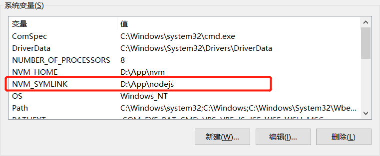
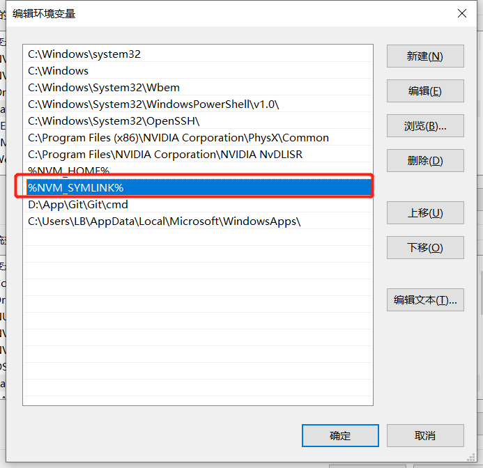
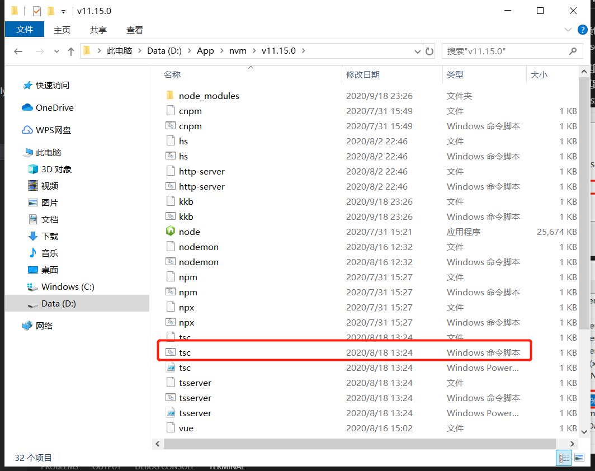
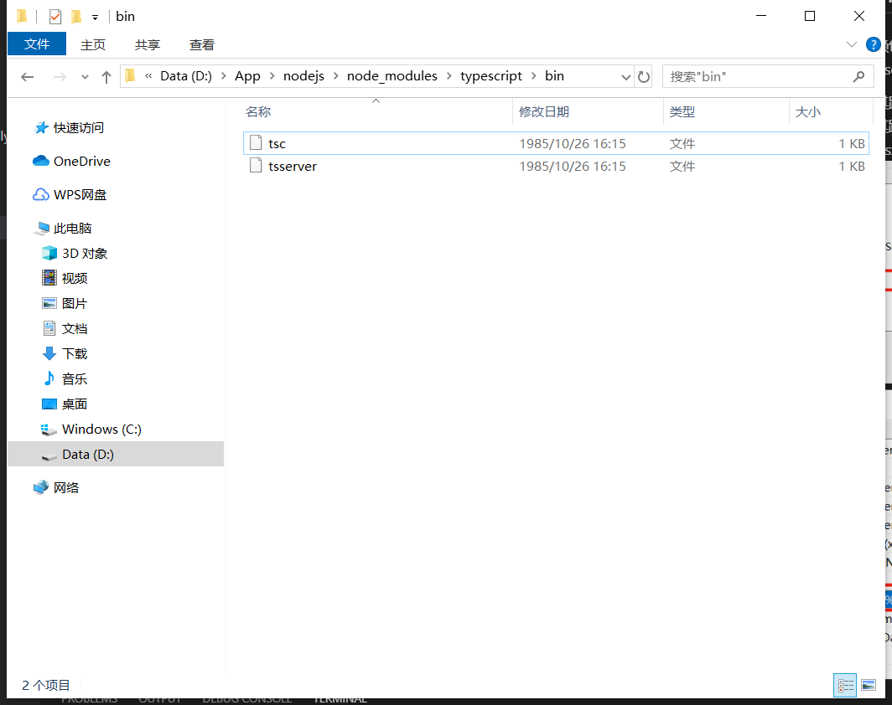
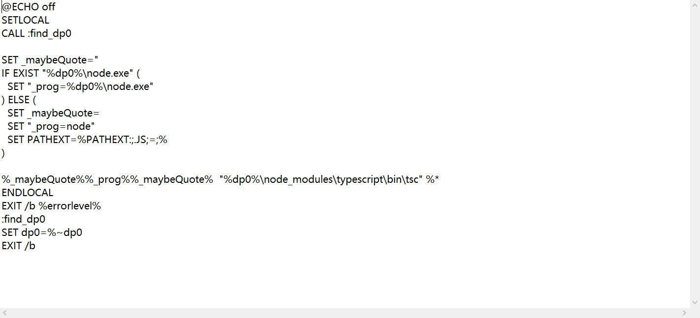

# npm包注册命令行命令的原理

在使用npm安装依赖包的时候，会发现安装到全局的包就可以使用该包包含的命令了，比如:npm http-server -g之后，命令行就可以直接使用http-server。其原理是：

1.安装node时会将其路径放到系统path中（我的是：D:\App\nodejs），这样命令行执行命令时就会在其路径下查找同名的.cmd文件，比如执行：tsx就会在D:\App\nodejs下找tsx.cmd



2.全局安装的npm包，会存放到全局的node_modules(我的是D:\App\nodejs\node_modules，每个npm包都存在一个bin目录用于存放命令行命令指向的入口，以tsx为例见下图)并生成一个.cmd文件（D:\App\nodejs目录下, 见下图）



3..cmd文件调用执行
当在命令行输入tsx时，系统会去存在path中的地址中寻找对应的.cmd文件，这里由于将D:\App\nodejs\放到了path中（步骤1）并且下面存在tsx.cmd(步骤2)，tsx.cmd被执行。tsx.cmd执行时调用了node 执行存在于对应包bin目录的js文件（tsx.cmd见下图，这里是D:\App\nodejs\node_modules\typescript\bin\tsx.js）


# 通过npm注册一个命令行命令
思路：创建一个npm包，将该npm包link到全局node_modules，并在全局下生成.cmd文件

步骤：
1.新建目录 registerCmd、registerCmd/bin

2.bin目录下新建文件cli.js
```
// 该行会影响到.cmd文件的生成，意思为以node运行指定路径文件
#!/usr/bin/env node

console.log('cli....')
```
3.命令行切换到registerCmd目录，执行npm init -y生成package.json文件，修改package.json的bin字段
```
"bin": {
    "mycli": "./bin/mycli.js"
  },
```

4.执行npm link（D:\App\nodejs下生成mycli.cmd）

5.cli命令注册完成，现在命令行可以执行命令mycli，会看到并输入cli...

# npx
执行非全局安装的命令，类似于npm scripts

原理：
运行的时候，到 node_modules/.bin 路径和环境变量 $PATH 里面，检查命令是否存在

参考：[通过npm包来制作命令行工具的原理](https://segmentfault.com/a/1190000015218126)